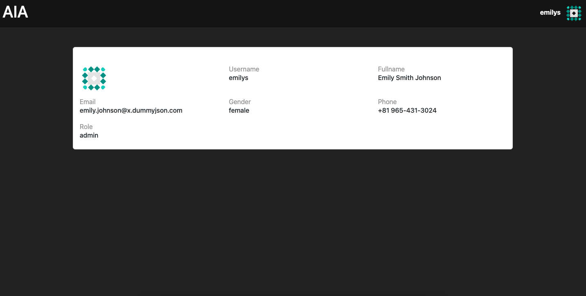

# Auth-In-Angular

This project was generated with Angular CLI version 18.0.6

## Install dependencies

Run npm install, to install all the required dependencies.

## Development server

Run ng serve for a dev server. Navigate to http://localhost:4200/. The app will automatically reload if you change any of the source files.

## About

This project implements a robust authentication system using JWT token and refresh token leveraging the power Angular and its key concepts:

- Standalone Components
- Services
- Routing
- Reactive Forms
- Interceptor
- Guard

It has integrated the API from [DummyJson](https://dummyjson.com/)

Demo Link: [Click here](https://auth-in-angular.netlify.app/)

Login Credentials:

- username: emilys
- password: emilyspass

## Screenshots

